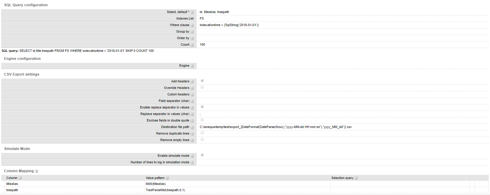

# ExportIndexToCSV
 
ExportIndexToCSV is a command that aims to simplify data export from your indexes. Unlike the ExecSqlCsv scmd command ExportIndexToCSV offer you additional settings to better control how data get exported. Below some real word usage of the command:

* File generation for entities whitelist, synonyms, custom files... based on metadata in your indexes
* Exporting to data to CSV or text format
* ETL using the "column mapping" section. You can use value patterns and selection queries to better control how and what is exported

Because this is a command plugin, you can schedule the file generation using a Job.

## Settings

### SQL Query configuration

Field | Type | Default value | Required | Comment
--- | --- | --- | --- | --- 
Select | string | * | No | You can use column or column aliases, distributions and corelations are not supported
Indexes List | list | | Yes | You can use indexes, index alias and index list alias
Where clause | string | | No | This parameter is optional. "where" keywork will be automatically added. This field support environement variables and value pattern expression.
Group by | string | | No | This parameter is optional. "group by" keywork will be automatically added
Order by | string | | No | This parameter is optional. "order by" keywork will be automatically added
Count | int | | No | This parameter is optional. If empty, export all. Skip value is always 0

### Engine configuration

Field | Type | Default value | Required | Comment
--- | --- | --- | --- | --- 
Engine | list | | No | This parameter is optional. If an Engine is selected, the SQL query will be executed on the selected Engine. This option is usefull if you use replicated indexes.

### CSV Export settings

Field | Type | Default value | Required | Comment
--- | --- | --- | --- | --- 
Add headers | bool | false | no | First line will include headers (column names)
Override headers | bool | false | no | If checked, headers will be replaced by 'custom headers' field
Custom headers | string | | no | Used only if 'override headers' is checked. Must contains the same number of elements than columns in the select statement and use the same separator as defined in 'separator'.
Field separator | char | , | No | Line fields separator
Enable replace separator in values | bool | false | No | If enabled, replace the "Field separator" char using the "Replace separator" char
Replace separator in values | char | / | No | Replace the separator with this charcarter in values. You may consider the 'Enclose fields in double quotes' option. Default: /
Enclose fields in double quote | bool | false | No | Allow escaping reserved characters (such as commas, double quotes)
Destination file path | string | | Yes | If not exist, file will be created. If exist, file content will be replaced. This field support environement variables and value pattern expression.
Remove duplicate lines | bool | false | No | For performances considerations, it's highly recommended to deduplicate content at query time using group by. This option will compute a hash key concatenating all fields of a row. Rows with the same hash key will be exported only once
Remove empty lines | bool | false | No | Do not export rows where all the fields are empty

### CSV Export settings

Field | Type | Default value | Required | Comment
--- | --- | --- | --- | --- 
Enable simulate mode | bool | false | No | In simulate mode, destination file is not created, result of the export can be found in the log file
Number of lines to log in simulation mode | int | 1000 | No | Command stop execution once this limit is reached

### Column Mapping

Column Mapping allow you to change the value of a column using a value pattern expression when the selection query match. Please note: 'Replace separator in values', 'Enclose fields in double quote', 'Remove duplicate lines' and 'Remove empty lines' options are all evaluated after the column mapping.

Field | Type | Default value | Required | Comment
--- | --- | --- | --- | --- 
Column | string | | yes | Column name as defined in select field. Support column alias.
Value Pattern | string | | yes | Value Pattern expression as decribed in https://doc-internal.sinequa.com/en.sinequa-es.v11/Content/en.sinequa-es.syntax.value-patterns.html
Selection Query | String | | no | Selection Query as described in https://doc-internal.sinequa.com/en.sinequa-es.v11/Content/en.sinequa-es.syntax.selection-query.html

The SQL query will be displayed once you have fielded the "SQL" parameters and save the form (using a WebFormControlPlugin in the ExportIndexToCsv.cs file)

## Install

Deploy the form override and the plugin file in your config:
* form-overrides/command.ExportIndexToCsv.xml
* plugins/ExportIndexToCsv/ExportIndexToCsv.cs
* Create a command named ExportIndexToCsv, using Command Type "Plugin" and selection the plugin "ExportIndexToCsv"
