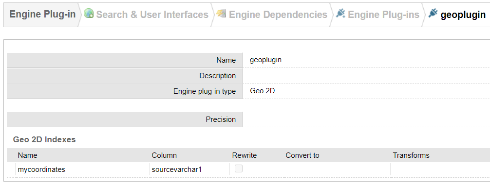
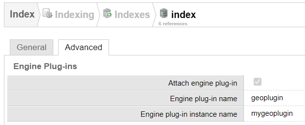

# Geo Search

Sinequa can search within geolocated data by setting up an engine plugin, enabling powerful functionalities, like computing the intersection of complex geographical primitives.

This plugin provides:

- A set of `FunctionPlugin` that make it easy to generate the primitives required by the engine *at indexing time*.
- A sample `QueryPlugin` that allows searching geolocated documents or records that fall within a coordinate rectangle *at query time*.

## Engine configuration

By default, the engine does not know about geographical coordinates, so we first have to enable this, using an **engine plugin**.

1. Create the plugin with the following configuration:

    *Search & User Interfaces > Engine Dependencies > Engine Plug-ins > New Plugin*

    

    We will store the geographical primitives in the `sourcevarchar1` column of your document index.

    (Note that "mycoordinates" is an internal index, which is different from your regular document indexes)

2. Attach this plugin to your document index:

    *Indexing > Indexes > index > Advanced*

    

3. Recreate your document index:

    *Operating tasks > Commands > type: Recreate index*

    

    Run the command (⚠️ existing data will be deleted).

## Geographical Data Indexing

At this point you are ready to index geolocated data. By default, the engine expects data in the [WKT format](https://en.wikipedia.org/wiki/Well-known_text_representation_of_geometry) ([GeoJSON](https://en.wikipedia.org/wiki/GeoJSON) can also be configured).

In your collection's configuration, you will need to create a **mapping** from the source's geographical coordinates to the index (`sourcevarchar1` column in the configuration above). However, the data is unlikely to be already nicely formatted in the WKT format.

This is where the attached plugins come in handy:

- The `GeoPoint` function plugin can convert a given pair of latitude and longitude into a `POINT` primitive:

    

- This function can be combined with the `LamberExt2GPS` function plugin, if the source data is provided in the *Lambert 2 Extended* coordinate system (instead of regular latitude and longitude):

    

- If the data is multivalued, the `GeoMultipoint` function plugin can be used to generate a `MULTIPOINT` primitive. The function expects 2 arguments: A list of semicolon-separated latitudes and a list of semicolon-separated longitudes:

    

Of course there are many other formats, coordinate systems and primitive types which may be of interest. If you happen to have developed one, feel free to enrich this plugin (included this documentation).

## Geographical Search

In order to search within an specific area, you must modify the `WHERE`-clause of the engine SQL query. To do so, we provide a sample `QueryPlugin`, which may need to be adapted depending on your needs.

The plugin must be referenced into your Query web service configuration (*Search-based applications > Web Services > Query*).

In your [SBA](https://sinequa.github.io/sba-angular/), you must modify your `Query` object by adding a `geoselect` property:

```ts
let rectangle = minLat+";"+maxLat+";"+minLng+";"+maxLng;
this.searchService.query["geoselect"] = rectangle;
this.searchService.search();
```

As is, the plugin expects a list of 4 numbers which define a rectangle, and will select all the documents with a primitive falling in that rectangle. But, of course, it is possible to modifying the plugin for it to accept many other types of primitives and predicates.

The plugin actually generates a `WHERE`-clause of this form (the plugin and index names are consistent with the ones chosen [above](#engine-configuration)):

```json
WHERE (...) AND JSON('{
    "type": "index-plugin-predicate",
    "target": "mygeoplugin",
    "params": {
        "op":"intersection",
        "a": {
            "type" : "index",
            "name" : "geo2d"
        },
        "b": {
            "type": "Feature",
            "properties": {},
            "geometry": {
                "type": "Polygon",
                "coordinates":[[[minLng, minLat],[minLng, maxLat],[maxLng, maxLat],[maxLng, minLat],[minLng, minLat]]]
            }
        }
    }
}')
```

To deactivate this selection, simply remove the `geoselect` property from the query object:

```ts
this.searchService.query["geoselect"] = undefined;
this.searchService.search();
```
